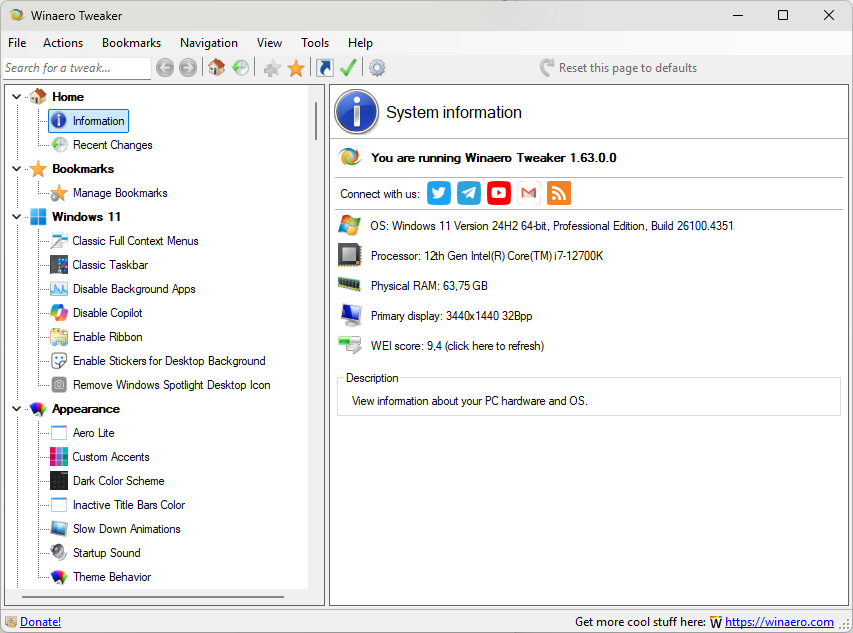
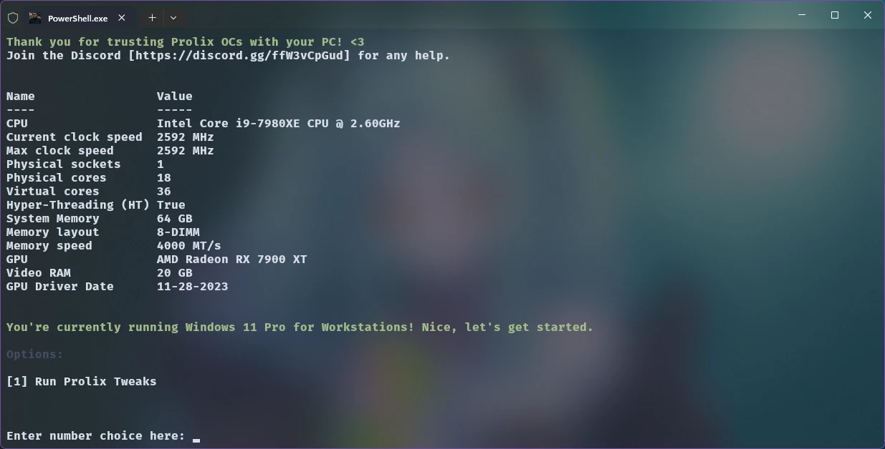
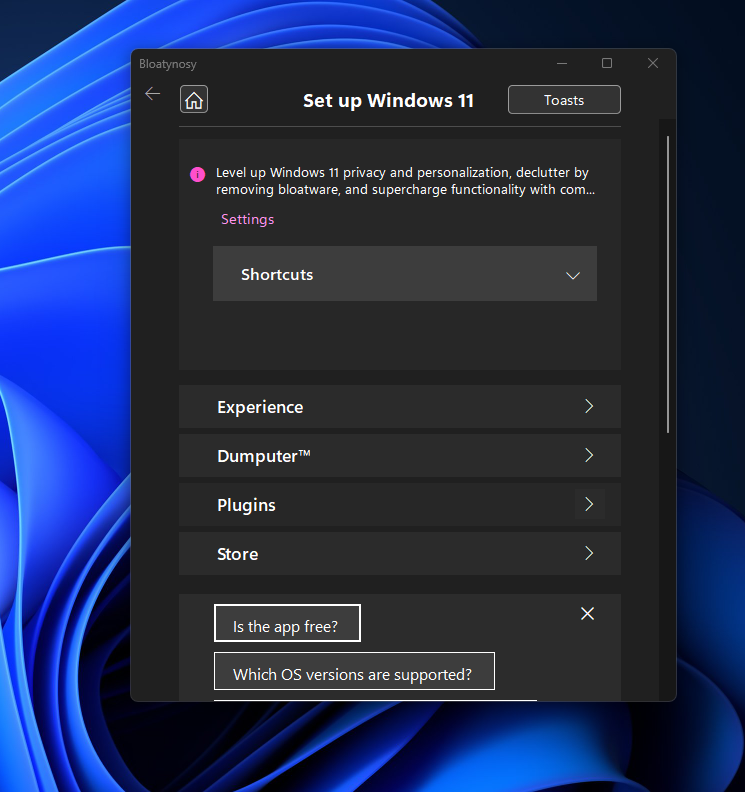
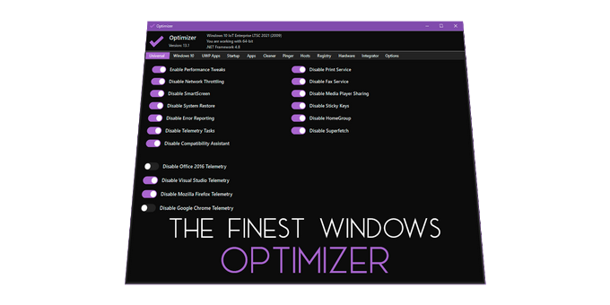

# Debloat

Windows comes, as you know, with a lot of wank. There are ways to make it less bloated either manually or by using scripts. The last reinstall i did, I decided not to run any of the usual scripts, and I haven't had any problems thus far. You can also run these scripts later on if you want.

> [!WARNING]
> One important thing to remember with these scripts is that they *can* ruin your installation in different ways. If you're not careful you might lose any ability to install updates and it can screw with your permissions etc. BE CAREFUL!

> [!ATTENTION]
> I would suggest creating a restore point before doing any of this. Open the start menu and type "restore" it should say "Create a restore point", do this. In case anything goes wrong, you can restore Windows to how it was before you made these changes.

## WinAero

This is the only one of these that I always use, it's a great app that lets you do a lot of tweaks that would require you to run a bunch of commands and/or editing your registry. Keep in mind that some of these can fuck your installation, and some of them are for Windows 10 only.

Install WinAero by typing this in Windows Terminal
   ```powershell
   winget install winaero.tweaker
   ```



Here is a list of the ones I change for my installation.
1. Windows 11 → Disable Background Apps → Check **"Disable background apps, all at once"**
2. Windows 11 → Disable Copilot → Check both **"Disable Copilot"** and **"Disable the Copilot taskbar button"**
3. Behavior → Ads and Unwanted Apps → Check **everything in the list**
4. Behavior → Disable Aero Shake → Check **"Disable Aero Shake"**
5. Behavior → Disable App Lookup in Store → Check **"Disable Look for an app in the store"**
6. Behavior → Error Reporting → Check **"Disable Error Reporting"**
7. Behavior → Disable App Lookup in Store → Check **"Disable You have new apps that can open this type of file"**
8. Behavior → Restore Point Frequency → Check **"Remove the manual Restore Point creation time limit"**
9. Context Menu → Create System Restore Point → Check **"Add Create Restore Point to Desktop context menu"**
10. Context Menu → Remove Default Entries → Check the following  
→ Scan with Windows Defender  
→ BitLocker context menu entries  
→ Extract All  
→ Burn disc image  
→ Share with/Give Access to  
→ Restore Previous Versions  
→ Troubleshoot Compatibility  
→ Windows Media Player  
→ Include in library  
→ Rotate Left/Right  
→ Add to Favorites  
→ Edit in Notepad  
→ Edit in Clipchamp  
11. Context Menu → Restart Explorer → Check **"Add Restart Explorer to Desktop context menu"**
12. Context Menu → Take Ownership → Check **"Add Take Ownership context menu to files and folders"**
13. Microsoft Edge → Disable Annoyances and Bloat → Go through this and check the stuff you want to remove
14. Microsoft Edge → Disable Desktop Shortcut Creation after updates → Check **"Don't create Microsoft Edge desktop shortcut after updating the browser"**
15. Settings and Control Panel → Disable online & Video Tips in Settings → Check **"Disable online & video tips in Settings"**
16. File Explorer → Disable Jump Lists → Check **"Disable Jump Lists"**
17. File Explorer → Disable Search History → Check **"Disable search history in File Explorer"**
18. File Explorer → File Explorer Starting Folder → Check **"This PC"**
19. File Explorer → Icon Cache Size → in Icon Cache Size, KB type **"2048"**
20. Network → Administrative Shares → Check **"Enable administrative shares"**
21. Network → Network Drives over UAC → Check **"Enable Network Drives over UAC"**
22. User Accounts → Disable UAC → Check **"Enable UAC"** then click **"Open UAC Settings"** and move slider down to **"Notify me only when apps try to make changes to my computer (do not dim my desktop)"** it's the second from the bottom
23. Windows Defender → Windows Security/Defender Tray Icon → Check **"Show Windows Security/Defender tray icon"**
24. Privacy → Disable Telemetry → Check **"Disable Telemtry and Data Collection"**. It says this is for Windows 10, but I always check it.

I would also suggest going through the entire list and see what you find. Maybe you want to add/remove something I haven't covered.

## Refyne

[Refyne](https://github.com/prolix-oc/Refyne) is a script designed to refine your system fully for multitasking, gaming, programming, multimedia, and more.



> [!WARNING]
> This can *seriously* fuck your Windows and stop it from getting updates. If you have no clue what you are doing, do NOT run this script. Also, PLEASE read the github page for the script. Keep in mind, this was last updated in 2024.

Run the script by typing this into Windows Terminal
   ```powershell
   iwr -useb https://github.com/prolix-oc/Refyne/releases/latest/download/Refyne.ps1 | iex
   ```

## BloatyNosy

[BloatyNosy](https://github.com/builtbybel/Bloatynosy) is an app that lets you remove a ton of crap, and tweaks Windows to be less bloated (gasp).



> [!ATTENTION]
> Less dangerous than Refyne, but please do read and understand what you are doing before you click anything.

You have to download the app from the github (linked above), and run it.

## Optimizer

[Optimizer](https://github.com/hellzerg/optimizer) is an advanced configuration utility designed to enhance your privacy and security on Windows.



> [!NOTE]
> The least dangerous of the three. Easy to use, and easy to understand. But, understand what you are doing before you click click.

You have to download the app from the github (linked above), and run it.

   **[Beautify Windows Terminal! →](terminal.md)**