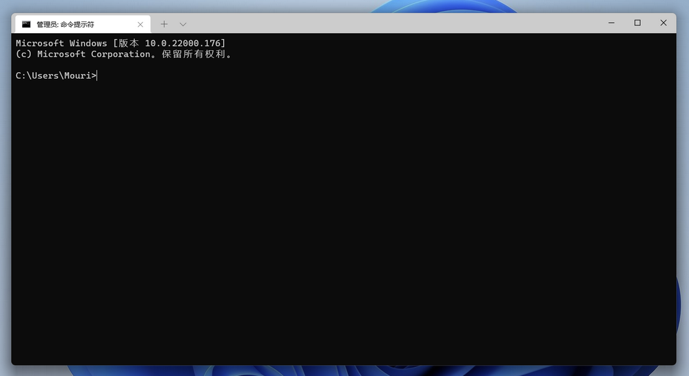

# Installing your software

> 💡 **Manual or script?**  
> You can easily make a script that let's you install what you need, although I would suggest you **install critical software manually**, so you can properly set it up. For software that isn't critical, you can easily use a script. I will give you both below.

What's seen as critical software is subjective. For me it's stuff like Dropbox, Firefox and Proton Pass, for you it can be different.

Default look
