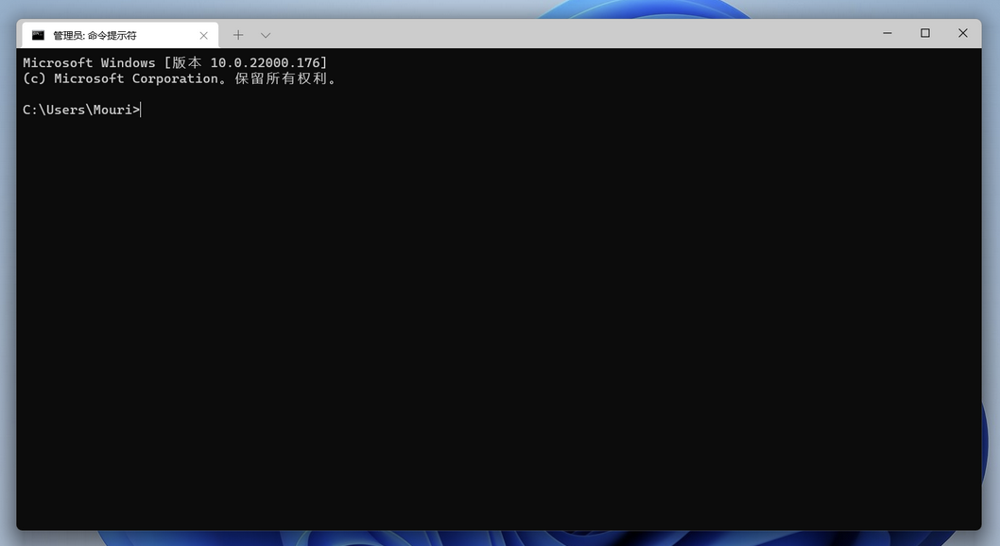
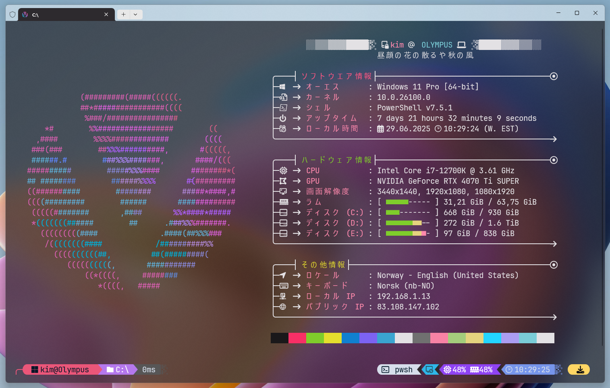

> [!ATTENTION]
> Remember to run Windows Terminal in Administrative Mode.

I like to make my Windows Terminal a little better looking then the defualt look.

Default look


What mine looks like


> ⚠️ **Why though?**  
> I like it, no other reason. You can skip this if you don't care about what your Windows terminal looks like. 😊

## JetBrains Mono font

JetBrains Mono is, in my view, the best font for terminal, VSCode etc.

📥 [Download from here](https://www.jetbrains.com/lp/mono/)

Click "Download font", unpack, select all the fonts in the folder ttf, right click and "Install"

## Oh My Posh

Oh My Posh is a prompt theme engine. It adds information to the prompt of Windows Terminal. So instad of just seeing C:\ it can show you time, if you are on a git repo, even what music you are playing on Spotify.


Install Oh My Posh by typing this in Windows Terminal
   ```terminal
   winget install JanDeDobbeleer.OhMyPosh -s winget
   ```
   or
   ```terminal
   choco install oh-my-posh
   ```

After that, use the [documentation to install it correctly](https://ohmyposh.dev/docs/installation/windows).

You can use [my theme if you want](_files/visneslabs.omp.json) (right click & save link as...)

## Terminal Icons

Install the terminal icons so you can prettify it by adding icons to different types of files and folders in Terminal.
   ```terminal
   Install-Module -Name Terminal-Icons -Repository PSGallery
   ```

## Winfetch

[Winfetch](https://github.com/lptstr/winfetch/) is like Neofetch on Linux. It shows you your system specs, and is mostly used to make screenshots of your computer desktop look nice.

Install Winfetch by tuping this in Windows Terminal
   ```terminal
   Install-Script winfetch
   ```
<br />

> [!ATTENTION|label:Install location] 
> App installed in: C:\Users\<user>\Documents\PowerShell\Scripts  
> Config installed in: C:\Users\<user>\.config\winfetch\config.ps1

If you want to use my version, [you can get it here](https://github.com/Visnes/winfetchplus/). Download the winfetch.ps1 file and place it in the app installation location (above). Also [download this file](_files/config.ps1) (right click & save as) and place this into the config folder (above).

## Edit your terminal profile

To make any of this work, you need to edit your terminal profile. This file might exist now, or not. If it doesn't make it.

Open your profile with the following command in Windows Terminal
   ```terminal
   notepad $PROFILE
   ```
If it says a file like that doesn't exist, close notepad and try again, if it still says it doesn't exist, create it and save the file.

Make sure the following is located in this file
   ```notepad
   #Terminal-Icons
   Import-Module Terminal-Icons

   #Activate Oh My Posh
   oh-my-posh init pwsh --config 'D:\Dropbox\05 Settings\visneslabs.omp.json' | Invoke-Expression

   #Winfetch
   Unblock-File -Path "C:\Users\kim\.config\winfetch\config.ps1"
   Unblock-File -Path "D:\Dropbox\Windows\Documents\PowerShell\Scripts\pwshfetch-test-1.ps1"
   Set-Alias winfetch pwshfetch-test-1
   winfetch
   ```
You can remove whatever part you didn't install. So if you didn't install Winfetch, just skip everything in the #Winfetch part.

<br /><br /><span style="font-size: 24px; float:right;">**[Let's get to installing software! ➡️](software.md)**</span><br /><br /><br />